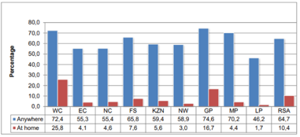
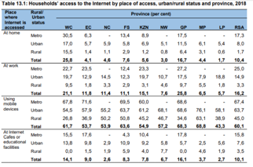

What Government strategies may be implemented in South Africa in order to bridge the gap in income inequality through successful policing of the 4thIndustrial Revolution? The 4th industrial revolution is an inevitable phenomenon which is
currently shaping the future of our world economy. What we are yet to find out the impact that it will have on our world economies, especially regarding the implications it may have on inequality.

Many people believe that the increased technological advancements will massively disrupt and segregate the labour market and in turn favour high-skilled workers, whilst leaving low-skilled workers behind.

Our idea is to analyse a few key implementation techniques that the Government may use to reduce inequality. These include: providing better network coverage across the entire country and significantly reducing data costs up to the point
where it is fully subsidized in some rural areas; restructuring certain aspects of the education system to expose learners to modern technology and even introducing a new tier to the education system in order to accommodate for low-skilled
workers in the labour market, allowing them to develop their current skillset into more finetuned skills appropriate for the modernization of the labour market. It will also be essential for the government to reengineer its taxation policy,
introducing a wealth tax, as well as come down hard on corruption within the government to allow for a source of adequate funding for the initial implementation of these potential policies.

<b>Internet Coverage

As the world moves swiftly into the fourth industrial revolution, the Internet is becoming a necessary utility. In Finland and Spain access to the Internet has even been declared a legal right. It allows people to have access to unlimited
information. Highly effective research and solutions can be accessed at the click of a button. In South Africa it could have many benefits for businesses; for example, a farmer would be able to access information on the best way to treat
their crops, an entrepreneur could use social media as a platform to advertise their brand and a student could use it to gain information from people from all over the world, the possibilities are endless. However, South Africa faces a
problem where only 64,7% of the population has access to the internet.

This graph demonstrates that only 64.7 percent of South Africans have access to the internet, however only 10.4 percent have access to the internet at home.

Table 13.1 shows that mobile devices are the main source of internet access(60,1%) and they have assisted in making the internet much more accessible to those living in rural areas.

South Africa has fairly good network coverage, with most of South Africa having access to 3G and a large portion of it having access to 4G. However, the economic climate has prevented South Africans from being able to purchase such
expensive data bundles. Vodacom and MTN are the main internet providers in South Africa. They arguably have a monopoly and instead of competing with each other to produce lower prices they have utilized their power and charge
disproportionately high fees.

Competing companies would generally drive down the prices, however, there are high costs involved in setting up the infrastructure needed to become an internet provider, therefore the barriers to entry are very high.

Another problem is that data bundles are cheaper when bought in bulk. This is a disservice to the poorer South African as they will be paying more for each megabyte, whereas it does not cost the internet providers more.

Data bundles also expire after a certain period, if not utilized. There is no other electronic good that after bought expires. This exploits customers of a product that they have purchased.

The government needs to step in and regulate pricing and internet providers. The Internet is becoming a necessary commodity and in order for South Africa to progress and the government needs to play their part in ensuring this. They need to
subsidize costs where necessary, but they should not allow the poor to bear the most expensive costs. The government should also distribute devices that can connect to the internet for those who cannot afford to purchase one themselves. The
internet provides a platform for tremendous growth. A field of growth that will be greatly enriched through access to the internet is education.

The South African education system is somewhat segregated, through the public/private school divide and the unequal access to opportunity. Some students have access to top shelf technology, such as tablets and laptops, while others cannot
afford basic stationary.

Keeping up to date with the dynamic economic climate is paramount for ensuring South Africans have the skills necessary for employment. IT should be made a compulsory subject and the government must allocate funding to making sure that all
students have access to basic technologies. The school curriculum should also place more emphasis on relevant skills.

Bursaries provide opportunities for the less fortunate and talented to study at prestigious institutions. These initiatives could place more of an emphasis on and reward individuals who display talent in a relevant field, that would be in
high demand in future.

The 4th industrial revolution presents opportunities for using cutting edge technologies, to increase the efficiency in which we do things, and for a spike in demand for relevant professional job opportunities. This being said, other careers
may suffer, through the automation of various tasks, and job creation will not occur without job loss.

South Africa had an alarmingly high unemployment rate of 29.1% and with the recent coronavirus outbreak, this percentage is sure to increase. With regards to the composition of the South African labor force, there is a shortage of skilled
labor and a surplus of unskilled labor. This complements the largely unequal society still South Africans live in.

According to a study of employment, unemployment, skills and economic growth, by StatsSA, 1.8 million skilled workers and 2.9 million unskilled workers were present in the 1994 South African economy. 3.8 million skilled workers and 4.3
million unskilled workers were active, in 2014. The domination of unskilled workers is an alarming trend, as these jobs are not suited for an automated and technologically advanced society.

Professional development opportunities should be made available, within the workplace, and unions can look to attain a certain level of job security, for vulnerable workers.

Educational improvements will also materialize into a more skilled population, in the long run.

The implementation of the aforementioned policies will certainly require a large injection of monetary resources in order to provide adequate funding for these changes.

In 2019, at the 6thFinancial Times African Summit meeting, President Cyril Ramaphosa addressed the fact that corruption is speculated to have cost South Africa as much as R1 trillion over the years. This money has been siphoned off state
coffers through sophisticated and corrupt means. If the government is able to implement policies and prevention techniques to eradicate corruption within state owned enterprises there is scope for the positive redistribution of these funds
which have otherwise been going to waste in the hands of corrupt government individuals.

By the end of 2018 corruption in state-owned enterprises had led to companies such as Eskom, SAA, Transnet, and SABC facing serious financial issues, it essential for these companies to come under extreme investigation and have their
financials constantly examined in order to track their internal allocation of funds in an attempt to reduce corruption. Once the government is able to mitigate corruption within these state-owned enterprises, it will allow for additional
funds to be allocated toward policies which have the potential to positively shape the future of South Africa.

According to a recent study done by the university of WITS in Johannesburg, about 50% of the adult population in South Africa survive with next to no savings which is hugely contrasted to the fact that 15% of the country’s entire wealth is
owned by just 3 500 individuals. South Africa faces an enormous problem in the growing amount of inequality amongst the people of the nation, testament to this is the fact that a massive 86% of South Africa’s wealth is accounted for by just
10% of the richest population. Quite simply, these figures illustrate the extreme inequality that plagues South Africa today and provide a clear picture as to just how much wealth is tied up in the top decile of the country.

It is essential that the government uses its power and ability to introduce fiscal policies in an attempt to bridge the gap in inequalities.

The introduction of a progressive wealth tax in South Africa would provide the government with innumerable amount of opportunity and much needed funding which would go toward the successful implementation of government policies.

The proposed policy would barely affect the livelihood of those being taxed but would instead be the beginning of change, creating a snowball effect, in making an immeasurable difference on the lives of millions of South Africans.

The progressive wealth tax would be fairly easily implemented and administered as the scope of the taxation policy would only affect the top 1% of the wealthiest people in the country. This would allow for a simple and fluid admin process
as only a small specialized unit would be required to administer the niche group of people being taxed.

It would be highly important for these processes to be run transparently with highly competent anti-corruption measures in place to ensure, that those subject to the wealth tax are cooperative and cognisant of the fact that their money is
being used effectively in an attempt to reduce the inequalities in the country and make it a better place for everyone living in it.

A research team at the university of Wits have recently developed a model for a progressive wealth tax as they believe it will play a pivotal role in combating the aftermath of the Covid-19 pandemic on our economy. The model looks at tax
increasing progressively through different brackets amongst the top 1% of wealth in the country. There are three prospective brackets: with the first including all those with a wealth between R3.6 million and R27 million being taxed at a
rate of 3%; the second bracket, includes those with a wealth that surpasses R27 million but falls short of R119 million, taxed at 5% and the last bracket which includes those with a wealth greater than R119 million who are taxed at 7%.

Their simulation suggests that such a wealth tax policy would essentially generate R143 billion. This is a colossal amount of money which would play a pivotal role in allowing the government to successfully implement the aforementioned
strategies.

To conclude, citizens are largely dependent on the government to address inequality and alleviate poverty. The 4th industrial revolution will inevitably worsen the alarming levels of poverty and inequality in South Africa, if measures are
not put in place urgently, to protect the most vulnerable in society. Funding is crucial and this can be achieved by a combination of State and private sector initiatives. Having said that, economic and social interactions are undergoing a
rapid and constantly evolving digital revolution and it is imperative that countries take proactive steps to increase access, affordability and minimise welfare loss. Through better educating the population and providing equal opportunities
to all citizens, we can see South Africa prosper through the next revolution, as a fair and equal society.

Citations:

>Mahlahla, S. (2020). Corruption has cost SA close to R1 trillion: Ramaphosa - SABC News - Breaking news, special reports, world, business, sport coverage of all South African current events. Africa's news leader. Retrieved 12 May 2020, from https://www.sabcnews.com/sabcnews/corruption-has-cost-sa-close-to-r1-trillion-ramaphosa/
Chatterjee, A., Czajka, L., & Gethin, A. (2020). Estimating the Distribution of Household Wealth in South Africa. Chatterjee, A., Czajka, L., & Gethin, A. (2020). Coronavirus: why South Africa needs a wealth tax now. Retrieved 8 May 2020, from https://theconversation.com/coronavirus-why-south-africa-needs-a-wealth-tax-now-137283
Bronkhorst, Q. (2020). South Africa’s unemployment rate unchanged at 29.1%. Retrieved 9 May 2020, from
https://businesstech.co.za/news/government/372994/south-africas-unemployment-rate-unchanged-at-29-1/
Employment, unemployment, skills and economic growth. An exploration of household survey evidence on skills and unemployment between 1994 and 2014. Retrieved 9 May from
https://www.statssa.gov.za/presentation/Stats%20SA%20presentation%20on%20skills%20and%20unemployment_16%20September.pdf
Statssa.gov.za. 2020. Retrieved 9 May from <http://www.statssa.gov.za/publications/P0318/P03182018.pdf> [Accessed 18 May 2020]. Chutel, L., 2020. Two Of Africa’S Biggest Telcos Have Expanded Across Africa At The Expense Of Poor South Africans. [online] Quartz Africa. Retrieved 9 May from <https://qz.com/africa/1608671/mtn-vodacom-overcharge-poor-south-africans-icasa/> [Accessed 18 May 2020].

